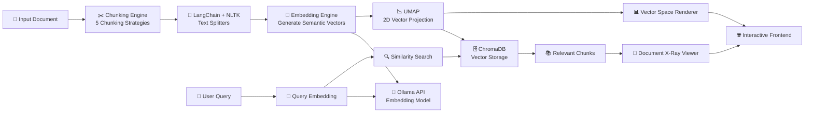

# 🔬 RAG Visualizer

**An X-Ray machine for Retrieval-Augmented Generation pipelines.**

RAG Visualizer is an interactive, local-first tool that lets you **see** what happens inside a RAG pipeline — from how your text gets chunked, to how those chunks land in vector space, to which chunks get retrieved for a given query. No cloud APIs, no black boxes. Everything runs on your machine with local Ollama models.

---

## ✨ Features

### 🧪 Phase 1 — Chunking Lab

Visualize and compare **5 chunking strategies** side-by-side:

| Strategy         | Description                                                                       |
| ---------------- | --------------------------------------------------------------------------------- |
| **Fixed Size**   | Cuts text every N tokens with configurable overlap                                |
| **Sentence**     | Splits on sentence boundaries using NLTK tokenizer                                |
| **Recursive**    | Applies a hierarchy of separators (`\n\n` → `\n` → `. ` → ` `)                    |
| **Parent-Child** | Two-level nested chunking — large parent windows with smaller child chunks inside |
| **Semantic**     | Detects topic shifts using embedding similarity + adaptive thresholding           |

- **Document X-Ray Viewer** — Original text with color-coded chunk boundaries and overlap regions
- **Chunk Inspector** — Stats panel showing total chunks, average token count, and per-chunk metadata

### 🌌 Phase 2 — Embedding Lab

- Generate embeddings using **3 local Ollama embedding models** (Nomic Embed Text, Embedding Gemma, Qwen3 Embedding)
- **UMAP dimensionality reduction** projects high-dimensional embeddings down to 2D
- **Interactive Canvas** with pan, zoom, hover tooltips, and click-to-select
- Parent-child connection lines visualized in vector space

### 🔍 Phase 3 — Retrieval

- **ChromaDB** persistent vector store — chunks are indexed on every run
- **Sonar Query Simulator** — type a natural language query and watch the retrieval happen in real time
- Retrieved chunks render as ranked result cards with distance scores
- **Sonar Probe** — click anywhere on the canvas to find the nearest chunks by 2D proximity
- **Document X-Ray Highlighting** — retrieved chunks glow in the original text with rank-based styling (gold for Rank 1, dashed for Rank 2, dotted for Rank 3)

### 📐 Phase 4 — Adaptive Thresholding

- Semantic chunking uses a **gradient derivative method** instead of a static threshold
- Computes mean + z-score-scaled standard deviation of inter-sentence embedding distances
- The slider controls the z-score multiplier, making the boundary detection adaptive to each document's unique distribution

---

## 🏗️ Architecture



### Data Flow

1. **User pastes text** → selects strategy + embedding model → clicks **Run Chunking**
2. **Backend** splits text into chunks → generates embeddings via Ollama → reduces to 2D via UMAP → stores in ChromaDB
3. **Frontend** renders the chunk boundaries in the X-Ray viewer and plots particles on the 2D canvas
4. **User queries** → backend embeds the query → retrieves top-K from ChromaDB → projects query point into 2D
5. **Frontend** draws sonar lines from query to retrieved chunks, highlights them in the document viewer

---

## 📁 Folder Structure

```
RAG-Visualizer/
├── backend/
│   ├── __init__.py
│   ├── main.py                    # FastAPI app, CORS, static file serving
│   ├── constants.py               # LLM prompt templates
│   ├── engines/
│   │   ├── __init__.py
│   │   ├── chunking.py            # 5 chunking strategies + ChunkingEngine
│   │   ├── embedding.py           # Ollama embedding adapter (httpx)
│   │   ├── llm_client.py          # Ollama LLM generation client
│   │   └── reducer.py             # UMAP 2D dimensionality reducer
│   ├── models/
│   │   ├── __init__.py
│   │   └── schemas.py             # Pydantic models (request/response schemas)
│   ├── routers/
│   │   ├── __init__.py
│   │   ├── chunk_router.py        # POST /api/chunk — chunking + embedding + UMAP
│   │   └── retrieval_router.py    # POST /api/retrieve — query + ChromaDB retrieval
│   └── storage/
│       └── vector_store.py        # ChromaDB persistent client wrapper
├── frontend/
│   ├── index.html                 # Single-page app (3-column layout)
│   ├── app.js                     # All frontend logic, canvas rendering, API calls
│   └── styles.css                 # Superman theme design system
├── store/                         # ChromaDB persistent data (gitignored)
├── .gitignore
├── .python-version                # Python 3.11
├── dev.bat                        # Dev server launcher
├── pyproject.toml                 # Project metadata & dependencies
├── uv.lock                        # Locked dependency versions
└── README.md
```

---

## 🚀 Getting Started

### Prerequisites

| Tool                                 | Version | Purpose                            |
| ------------------------------------ | ------- | ---------------------------------- |
| **Python**                           | ≥ 3.11  | Runtime                            |
| **[uv](https://docs.astral.sh/uv/)** | Latest  | Fast Python package manager        |
| **[Ollama](https://ollama.com/)**    | Latest  | Local LLM & embedding model server |

### 1. Install uv

```bash
# Windows (PowerShell)
powershell -ExecutionPolicy ByPass -c "irm https://astral.sh/uv/install.ps1 | iex"

# macOS / Linux
curl -LsSf https://astral.sh/uv/install.sh | sh
```

### 2. Clone the Repository

```bash
git clone https://github.com/<your-username>/RAG-Visualizer.git
cd RAG-Visualizer
```

### 3. Install Dependencies

```bash
uv sync
```

This reads `pyproject.toml` and `uv.lock`, creates a `.venv`, and installs all dependencies in seconds.

### 4. Pull Ollama Models

Make sure Ollama is running, then pull the required models:

```bash
# Embedding models (at least one required)
ollama pull nomic-embed-text
ollama pull qwen3-embedding:0.6b

# LLM model (for future features)
ollama pull gemma4:e2b
```

### 5. Run the Dev Server

```bash
# Using the dev script (Windows)
.\dev.bat

# Or directly with uv
uv run uvicorn backend.main:app --reload --port 8080
```

Open **http://localhost:8080** in your browser.

---

## 🎮 Usage Guide

### Chunking Lab

1. **Paste your text** into the input area on the left panel
2. **Select a chunking strategy** — click one of the 5 strategy cards
3. **Tune parameters** — adjust chunk size, overlap, or semantic threshold with the sliders
4. **Choose an embedding model** from the dropdown
5. Click **⚡ Run Chunking**
6. Explore:
   - **Document Viewer tab** — see color-coded chunk boundaries in your text
   - **Vector Space 2D tab** — see chunks plotted as interactive particles
   - **Chunk Inspector** (right panel) — browse individual chunks with metadata

### Sonar Query Simulator

1. Switch to the **Vector Space 2D** tab
2. Type a query in the **Sonar Query Simulator** bar (e.g., `"linear regression"`)
3. Click **🔍 Query** — watch the sonar ping animate across the canvas
4. Retrieved chunks appear as ranked cards with distance scores
5. The **Document Viewer** automatically highlights retrieved chunks with rank-based glow effects

---

## ⚙️ API Reference

### `POST /api/chunk`

Chunks input text, generates embeddings, reduces to 2D, and stores in ChromaDB.

**Request Body:**

```json
{
  "text": "Your input text...",
  "runs": [
    {
      "strategy": "fixed_size",
      "config": {
        "chunk_size": 500,
        "chunk_overlap": 20,
        "tokenizer": "cl100k_base"
      }
    }
  ],
  "embedding_model": "nomic-embed-text",
  "n_neighbors": 15,
  "min_dist": 0.1
}
```

**Response:** `ChunkResponse` with chunks, stats, 2D coordinates, and embeddings.

### `POST /api/retrieve`

Embeds a query and retrieves the top-K most similar chunks from ChromaDB.

**Request Body:**

```json
{
  "search_text": "What is gradient descent?",
  "embedding_model": "nomic-embed-text",
  "strategy": "fixed_size",
  "top_k": 3
}
```

**Response:** `QueryResponse` with query coordinates, retrieved chunks, and distance scores.

### `GET /api/strategies`

Returns the list of available chunking strategies.

---

## 🛠️ Tech Stack

| Layer                        | Technology                     | Role                                                    |
| ---------------------------- | ------------------------------ | ------------------------------------------------------- |
| **Frontend**                 | Vanilla HTML / CSS / JS        | Single-page app, Canvas 2D rendering                    |
| **Backend**                  | FastAPI (Python 3.11)          | REST API, async request handling                        |
| **Chunking**                 | LangChain Text Splitters, NLTK | 5 chunking strategy implementations                     |
| **Tokenization**             | tiktoken (`cl100k_base`)       | Token counting (OpenAI-compatible)                      |
| **Embeddings**               | Ollama (local models)          | `nomic-embed-text`, `EmbeddingGemma`, `qwen3-embedding` |
| **Dimensionality Reduction** | UMAP (`umap-learn`)            | High-dim → 2D projection for visualization              |
| **Vector Database**          | ChromaDB (persistent)          | Cosine similarity search with HNSW index                |
| **Package Manager**          | uv                             | Dependency management & virtual environments            |

## Technologies

- [Ollama](https://ollama.com/) — Local LLM inference
- [ChromaDB](https://www.trychroma.com/) — Open-source vector database
- [LangChain](https://www.langchain.com/) — Text splitting utilities
- [UMAP](https://umap-learn.readthedocs.io/) — Dimensionality reduction
- [FastAPI](https://fastapi.tiangolo.com/) — Modern Python web framework
